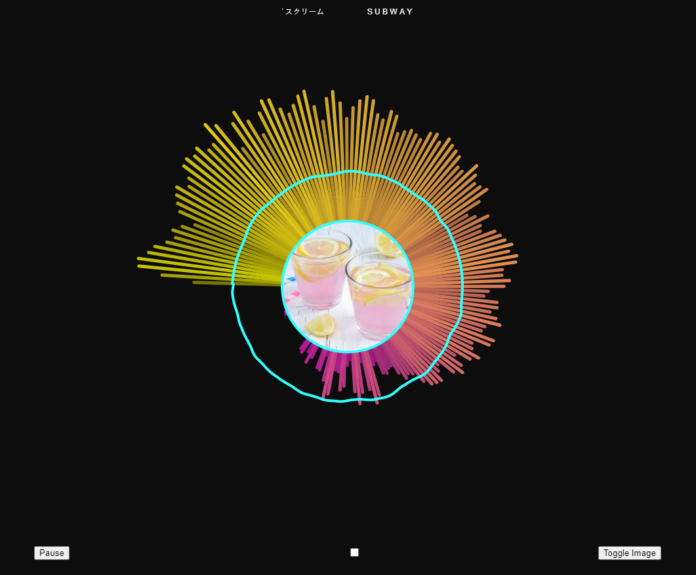

The deployed website: https://gmillare4.github.io/Audio-Visualizer/

This project is an audio visualizer that has two modes:

1. The first mode visualizes a preloaded track
2. The second mode visualizes microphone input (may not work on all browsers)

It does this by using the amplitude of different frequencies of a given sound to create the moving bars in addition to the waveform that rotates around the center of the canvas.

This project was built using:

p5.js is used to easily draw on a canvas while the p5.js sound library was used to incorporate audio and microphone functionality.

GitHub Pages is used to deploy this website

Features:

- Play/Pause button starts and stops the music + visualization
- Checkbox toggles microphone input + visualization (may not work on all browsers)
- Toggle Image button toggles the center image used
- Visualization
  - Audio waveform
  - Bars represent a frequency range of the sound
    - Size is determined by amplitude
    - Color is determined by both amplitude and frequency
  - Background brightness is determined by average amplitude
- Song title looping animation
